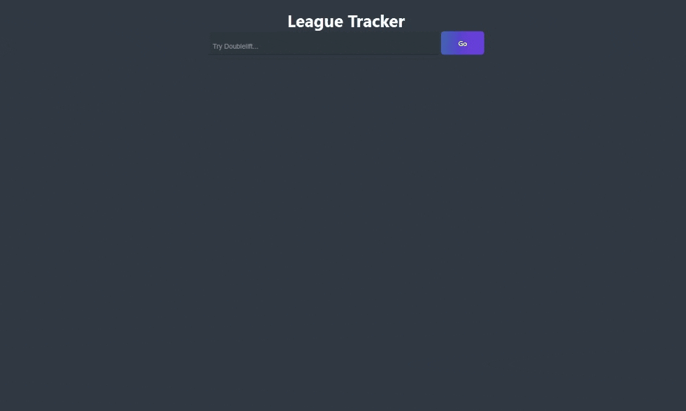

### League Match History 🖥️
- Match History application to pull back various information from Riot APIS display to the user. 
- Visit Site [https://matchhistory.netlify.app/](https://matchhistory.netlify.app/).

---

 

# 👨‍💻 Tech stack

Here's a brief high-level overview of the tech stack the Match History App uses:

- This project uses the [REACT](https://reactjs.org/) front end in combination with [ChartJS](https://www.chartjs.org/). 
- APIs were developed using AWS API Gateway (https://aws.amazon.com/api-gateway/). 

 

---
